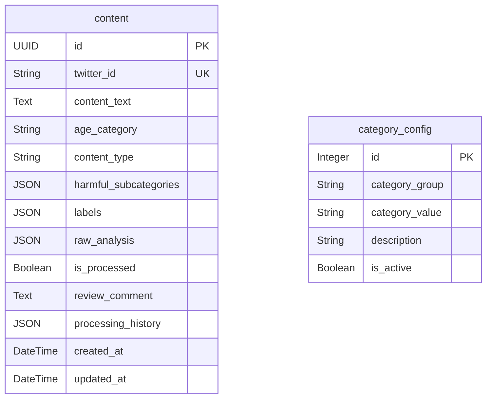

# RedPill Radar

Content analysis & moderation API for detecting harmful/hateful content targeting women on social media (Twitter/X).

## Features

- **Content Ingestion** — Accept tweets via API, automatically analyze with Groq LLM
- **Multi-label Classification** — Age category, content type (safe/harmful), harmful subcategories
- **Configurable Categories** — Add, update, or deactivate classification categories at runtime
- **Processing Workflow** — Mark content as processed, add reviewer comments, track full audit history
- **Re-processing** — Re-analyze individual items or trigger bulk background re-analysis

## Setup

### 1. Install dependencies

```bash
cd redpill-radar
python -m venv venv

# Windows
venv\Scripts\activate
# macOS/Linux
source venv/bin/activate

pip install -r requirements.txt
```

### 2. Configure environment

```bash
copy .env.example .env
```

Edit `.env` and set your Groq API key:

```
GROQ_API_KEY=gsk_your_actual_key_here
GROQ_MODEL=llama-3.3-70b-versatile
DATABASE_URL=sqlite+aiosqlite:///./data/redpill_radar.db
```

### 3. Run the server

```bash
uvicorn app.main:app --reload --host 0.0.0.0 --port 8000
```

The API will be available at `http://localhost:8000`. Interactive docs at `http://localhost:8000/docs`.

## Database Structure

SQLite database (`data/redpill_radar.db`) is auto-created on first run with two tables.

### `content` Table

Stores ingested tweets and their Groq analysis results.

| Column | Type | Description |
|--------|------|-------------|
| `id` | UUID (PK) | Internal unique tracking ID, auto-generated |
| `twitter_id` | String (unique, indexed) | Twitter/X post ID from the crawler |
| `content_text` | Text | Raw tweet content |
| `age_category` | String (nullable) | Classified age group, e.g. `12-18`, `18+` |
| `content_type` | String (nullable) | `safe` or `harmful` |
| `harmful_subcategories` | JSON (nullable) | List of subcategories, e.g. `["female_abuse", "female_sexual_content"]` |
| `labels` | JSON (nullable) | Full structured label set from Groq (includes confidence + reasoning) |
| `raw_analysis` | JSON (nullable) | Raw Groq API response with model info and token usage |
| `is_processed` | Boolean | `false` by default; set to `true` when reviewed |
| `review_comment` | Text (nullable) | Response comment added by reviewer during processing |
| `processing_history` | JSON | Audit trail -- array of `{timestamp, action, old_value, new_value, comment}` entries |
| `created_at` | DateTime | When the content was first ingested |
| `updated_at` | DateTime | Last modification timestamp (auto-updated) |

### `category_config` Table

Configurable classification categories used to build Groq analysis prompts dynamically.

| Column | Type | Description |
|--------|------|-------------|
| `id` | Integer (PK) | Auto-increment |
| `category_group` | String (indexed) | Group name, e.g. `age_category`, `content_type`, `harmful_subcategory` |
| `category_value` | String | Value within the group, e.g. `12-18`, `female_abuse` |
| `description` | String (nullable) | Human-readable description of the category |
| `is_active` | Boolean | Enable/disable without deleting (inactive categories are excluded from prompts) |

### ER Diagram



## API Endpoints

### Health Check

```
GET /health
```

### Content

| Method | Endpoint | Description |
|--------|----------|-------------|
| POST | `/api/v1/content` | Ingest a tweet (analyzes immediately) |
| GET | `/api/v1/content` | List content with filters (`?is_processed=false&content_type=harmful&page=1&limit=20`) |
| GET | `/api/v1/content/{id}` | Get single content item by UUID |
| PATCH | `/api/v1/content/{id}/status` | Mark processed/unprocessed + add review comment |

### Re-processing

| Method | Endpoint | Description |
|--------|----------|-------------|
| POST | `/api/v1/content/reprocess/{id}` | Re-analyze single item |
| POST | `/api/v1/content/reprocess` | Bulk re-analyze all unprocessed (background) |

### Categories

| Method | Endpoint | Description |
|--------|----------|-------------|
| GET | `/api/v1/categories` | List all categories |
| POST | `/api/v1/categories` | Add a new category |
| PATCH | `/api/v1/categories/{id}` | Update a category |
| DELETE | `/api/v1/categories/{id}` | Delete a category |

## Example Usage

### Ingest content

```bash
curl -X POST http://localhost:8000/api/v1/content \
  -H "Content-Type: application/json" \
  -d '{"twitter_id": "1234567890", "content_text": "Example tweet content here"}'
```

### Mark as processed with review comment

```bash
curl -X PATCH http://localhost:8000/api/v1/content/{uuid}/status \
  -H "Content-Type: application/json" \
  -d '{"is_processed": true, "review_comment": "Verified and flagged for action."}'
```

### Add a new category

```bash
curl -X POST http://localhost:8000/api/v1/categories \
  -H "Content-Type: application/json" \
  -d '{"category_group": "harmful_subcategory", "category_value": "cyberbullying", "description": "Online bullying targeting women"}'
```

## Default Categories (seeded on first run)

- **age_category**: `12-18`, `18+`
- **content_type**: `safe`, `harmful`
- **harmful_subcategory**: `female_abuse`, `female_sexual_content`
